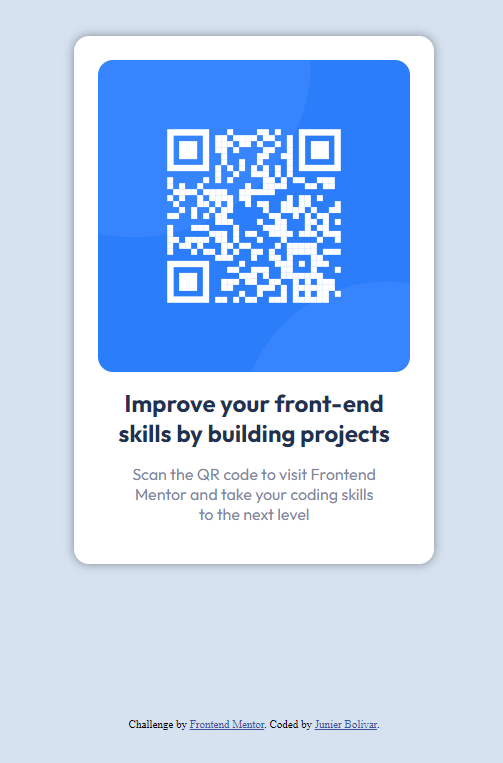

# Frontend Mentor - QR code component solution

This is a solution to the [QR code component challenge on Frontend Mentor](https://www.frontendmentor.io/challenges/qr-code-component-iux_sIO_H). Frontend Mentor challenges help you improve your coding skills by building realistic projects.

## Table of contents

- [Overview](#overview)
  - [Screenshot](#screenshot)
  - [Links](#links)
- [My process](#my-process)
  - [Built with](#built-with)
  - [What I learned](#what-i-learned)
  - [Continued development](#continued-development)
  - [Useful resources](#useful-resources)
- [Author](#author)
- [Acknowledgments](#acknowledgments)

**Note: Delete this note and update the table of contents based on what sections you keep.**

## Overview

### Screenshot



### Links

- Solution URL: (https://github.com/Frontend-Mentorr/HTML-CSS_qr-code-component-main)
- Live Site URL: (https://junbol-frontend-mentor.github.io/HTML-CSS_qr-code-component-main/)

## My process

### Built with

- Semantic HTML5 markup
- CSS custom properties
- Flexbox
- Mobile-first workflow

### What I learned

```css
main {
  display: flex;
  justify-content: center; /* This centers the children of .mainContainer vertically along the main axis */
  align-items: center; /* This centers the children of .mainContainer horizontally along the cross axis */
  display: flex;
  flex-direction: column;
  height: 90vh; /* This ensures that the body takes the full viewport height.The only way to centered vertically is to use this on main */
}

h2 {
  font-family: Outfit;
  font-weight: 700;
  width: 300px;
  text-align: center;
  margin-bottom: 1rem;
  color: var(--color-dark-blue);
  transition-duration: 1200ms;
  transition-timing-function: ease;
}
```

### Continued development

I would like to continue studying CSS animation, transitions and FX like parallax.

### Useful resources

- [web.dev](https://web.dev/learn/css) - This helped me for get back on track with CSS.
- [w3schools](https://www.w3schools.com/css/default.asp) - The one place to refresh stuff in practical way.

## Author

- Website - [Junier Bolivar](https://www.bolivarcreativedesign.com)
- Frontend Mentor - [Junbol](https://www.frontendmentor.io/profile/Junbol)
- Twitter - [@JunierBolivar](https://www.twitter.com/@JunierBolivar)

## Acknowledgments
